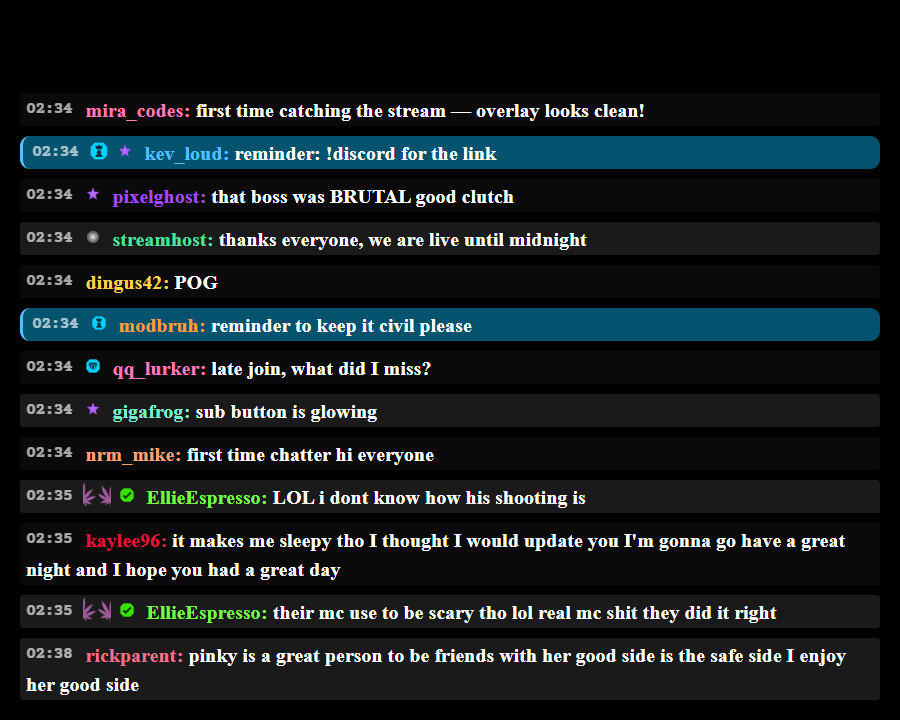
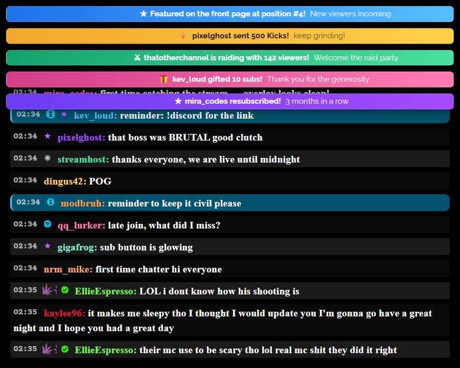
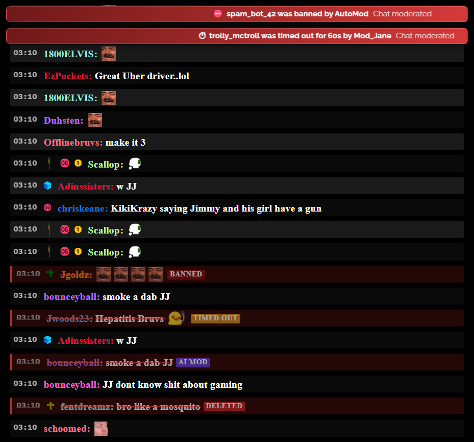
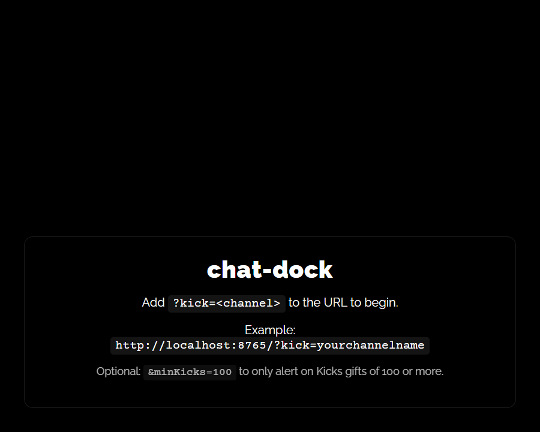

<div align="center">

# chat-dock

### A zero-install, browser-only chat overlay for [Kick.com](https://kick.com) streamers

Drop a URL into your broadcasting software's browser source — get live chat, badges, 7TV emotes, pinned messages, stacking alerts, and moderation visibility on stream. No backend. No accounts. No build step.

<p>
  
  
  
  
  <a href="https://github.com/zachisfine/chat-dock/stargazers"></a>
  <a href="https://github.com/zachisfine/chat-dock/issues"></a>
</p>

</div>

---

## Table of contents

- [Highlights](#highlights)
- [Screenshots](#screenshots)
- [Quick start](#quick-start)
  - [Host it for free on GitHub Pages](#host-it-for-free-on-github-pages)
  - [Optional URL parameters](#optional-url-parameters)
- [Features](#features)
- [Why chat-dock?](#why-chat-dock)
- [FAQ — Integrating with your streaming software](#faq--integrating-with-your-streaming-software)
  - [How do I add it to OBS Studio?](#how-do-i-add-it-to-obs-studio)
  - [How do I add it to Meld Studio?](#how-do-i-add-it-to-meld-studio)
  - [Can I use it with Streamlabs Desktop / XSplit / vMix?](#can-i-use-it-with-streamlabs-desktop--xsplit--vmix)
  - [How do I use it while streaming from my iPhone?](#how-do-i-use-it-while-streaming-from-my-iphone)
  - [How do I use it while streaming from Android?](#how-do-i-use-it-while-streaming-from-android)
  - [Why isn't an alert firing for sub/gift/raid events on my channel?](#why-isnt-an-alert-firing-for-subgiftraid-events-on-my-channel)
  - [Can I change the look of the alerts / chat?](#can-i-change-the-look-of-the-alerts--chat)
  - [Does it support Twitch?](#does-it-support-twitch)
- [Project layout](#project-layout)
- [Documentation](#documentation)
- [Roadmap](#roadmap)
- [Known issues](#known-issues)
- [Contributing](#contributing)
- [License](#license)

---

## Highlights

> 🚀 **Drop-in URL** — point `?kick=<channel>` at any Kick streamer; no per-user config.
>
> 🛡️ **Moderation visibility** — AI-mod, manual delete, timeouts, and bans get distinct color-coded tags so you *see* what got nuked instead of messages silently vanishing.
>
> 🎨 **Compact zebra chat + marquee alerts** styled to feel native to Kick, not bolted on.

## Screenshots

| Live chat — compact zebra rows, mod messages highlighted | Stacking marquee alerts above chat |
|---|---|
|  |  |

**Moderation visibility** — every action gets its own tag (`AI MOD`, `TIMED OUT`, `BANNED`, `DELETED`) plus a stacking alert at the top:



The setup screen rendered when no `?kick=` channel is supplied:



---

## Quick start

The fastest path is **GitHub Pages** (instructions below) — you get a public HTTPS URL for free in about two minutes. If you'd rather not host it at all, you can also open `index.html` straight from disk:

```
file:///path/to/chat-dock/index.html?kick=yourchannelname
```

If you open the page without `?kick=`, you'll get a setup screen telling you what's missing.

### Host it for free on GitHub Pages

GitHub will host this overlay on a free `*.github.io` subdomain at no cost — perfect for OBS / Meld / vMix browser sources because you get a stable HTTPS URL with no install or backend.

1. **Fork this repo** on GitHub (top-right **Fork** button). You'll end up with `https://github.com/<your-username>/chat-dock`.
2. In your fork, go to **Settings → Pages** (left sidebar).
3. Under **Build and deployment → Source**, pick **Deploy from a branch**.
4. Under **Branch**, pick `main` and folder `/ (root)`, then click **Save**.
5. Wait ~1–2 minutes. Refresh the Pages settings page — you'll see a green banner with your live URL:

   ```
   https://<your-username>.github.io/chat-dock/
   ```

6. Append `?kick=<your-channel-name>` and you're done:

   ```
   https://<your-username>.github.io/chat-dock/?kick=yourchannelname
   ```

7. Paste that URL into OBS / Meld / Streamlabs as a Browser Source (see the [FAQ](#faq--integrating-with-your-streaming-software)).

> 💡 **Updating the overlay:** every time you push (or sync your fork from upstream), GitHub Pages auto-rebuilds within a minute. No deploy step.

> 💡 **Custom domain:** if you own a domain, you can point it at your GitHub Pages site via **Settings → Pages → Custom domain**. Same overlay, your own URL.

> ⚠️ **Repo must be public** for GitHub Pages on a free GitHub account. If you want the source private, you'll need GitHub Pro or a different static host (Netlify, Cloudflare Pages, Vercel — all free tiers also work, same drag-and-drop flow).

### Optional URL parameters

| Param | Default | What it does |
|-------|---------|--------------|
| `kick` | *(required)* | Your Kick.com channel name, lowercase, no `@`. |
| `minKicks` | `0` | Minimum Kicks-tip amount that fires an on-screen alert. Set higher to suppress small tips. Example: `&minKicks=100`. |
| `fade` | `off` | Set to `on` to fade old messages out as they're trimmed. |
| `fadeTime` | `1000` | Fade duration in ms (used when `fade=on`). |

Full URL example:

```
https://your-host.example/chat-dock/index.html?kick=yourchannelname&minKicks=50&fade=on
```

---

## Features

**Chat rendering**
- Live chat via Kick's public Pusher WebSocket — no auth, no API key.
- Compact single-line **zebra-striped** rows so dense chat stays readable.
- **7TV emotes** — your channel set *and* the global set.
- Kick's native emotes & emojis, plus auto-linkification of URLs.
- **Pinned messages** with a thumbtack icon; auto-removed when the streamer un-pins.

**Badges & identity**
- Subscriber tiers (uses your channel's *actual* sub-badge tiers from the Kick API).
- Moderator, VIP, founder, verified, **staff**, OG.
- Tiered sub-gifter icons (1-24, 25-49, 50-99, 100-199, 200+).
- **Kick staff get a distinctive magenta username** so you notice when an official Kick employee is in chat.
- **Mods** get a cyan-highlighted row + accent border so the streamer sees a real human mod typing.

**Moderation visibility** *(new)*
- 🔴 `DELETED` — manual mod or streamer delete
- 🟣 `AI MOD` — Kick's AutoMod removed the message
- 🟠 `TIMED OUT` — user was timed out; affected messages get tagged
- 🟥 `BANNED` — user was permanently banned
- Tagged messages linger for 10 seconds (strikethrough + red tint + reason tag) before they leave the DOM — no more "wait, what just disappeared?"
- Stacking alert fires for every ban and timeout, showing the moderator's name and duration.

**Stacking alerts** at the top of the overlay for:
- 🟣 **New subscriptions** (and resubs with month count)
- 🌸 **Gifted subs** (single or bulk)
- 🟢 **Raids / hosts** (with incoming viewer count)
- 🟡 **Kicks tips** (with configurable minimum threshold)
- 🔵 **Front-page features** (when your channel gets featured)
- 🔴 **Bans & timeouts** (with moderator name)

Alerts marquee right-to-left like Kick's native ticker, stack when multiple events arrive close together, and fade after ~12 seconds.

**Reliability & polish**
- **Auto-reconnect** — dropped WebSocket triggers a 1-second retry loop; you never need to refresh the browser source.
- **Hidden scrollbar** so the overlay stays clean even when chat is mid-flight.
- **`!nightmode` / `!daymode`** chat command (moderator or broadcaster only).
- Graceful **badge fallback chain** — unknown badge types fall back to a generic SVG instead of broken-image icons.

---

## Why chat-dock?

| | chat-dock | StreamElements / Streamlabs widgets | A custom Node app |
|---|---|---|---|
| Works with Kick.com | ✅ | ❌ (Twitch/YouTube focus) | Whatever you build |
| Zero install / zero account | ✅ | ❌ requires login + widget setup | ❌ |
| Free public HTTPS hosting | ✅ via GitHub Pages | ✅ but locked to their domain | DIY |
| 7TV emotes out of the box | ✅ | ❌ | DIY |
| Stackable alerts for subs/gifts/raids/Kicks tips | ✅ | Partial | DIY |
| Moderation visibility (AI mod / ban / timeout tags) | ✅ | ❌ | DIY |
| Customise via CSS variables | ✅ | Limited | ✅ |
| Total bytes shipped | ~30 KB | several MB | Whatever you ship |

If you stream on Kick and want a polished overlay without spinning up infrastructure or signing up for yet another SaaS, chat-dock is the path of least resistance.

---

## FAQ — Integrating with your streaming software

### How do I add it to OBS Studio?

1. In your scene, click **+** in the Sources panel → **Browser**.
2. Name it "Chat Dock" and click OK.
3. In the source properties:
   - **URL:** point at where you're hosting `index.html`, with `?kick=yourchannelname` (and `&minKicks=…` if you want).
     - Hosted: e.g. `https://yourname.github.io/chat-dock/?kick=you` (see [Host it for free on GitHub Pages](#host-it-for-free-on-github-pages))
     - Local file: drop the full `file:///` path, or use OBS's "Local File" checkbox and browse to `index.html`, then put `?kick=you` in the **URL bar** that appears.
   - **Width / Height:** match the region of the screen you want chat to occupy (e.g. `400 × 800` for a vertical sidebar).
   - **Custom CSS:** leave blank — `style.css` already handles everything. If you want to override, see [`docs/design-guidelines.md`](docs/design-guidelines.md).
   - **Refresh browser when scene becomes active:** ✅ recommended. Forces a clean WebSocket connect every time you switch to the scene.
   - **Shutdown source when not visible:** ✅ optional. Saves resources when the overlay isn't on screen.
4. Position and resize the source in your scene. Done.

If chat doesn't appear, open OBS's **View → Docks → Browser Source Interaction**, or hit the source's "Refresh cache of current page" button. Browser console output (visible via the Interact panel's right-click → Inspect on Windows OBS) will tell you whether the WebSocket connected.

### How do I add it to Meld Studio?

Meld Studio supports web overlays through its **Web Source** layer.

1. In Meld, add a new **Web Source** to your scene.
2. Paste in the same URL you'd use for OBS, including `?kick=yourchannelname`.
3. Set the source dimensions to match the overlay region you want.
4. Pin the source on top of your camera / game layer.

Meld's Web Source uses a Chromium engine identical (in capability) to OBS's browser source, so the overlay behaves the same way — alerts, emotes, and WebSocket reconnection all work without changes.

Meld doesn't expose a "refresh on scene activate" toggle in the same place OBS does. If your overlay ever desyncs, simply right-click the Web Source → Reload.

### Can I use it with Streamlabs Desktop / XSplit / vMix?

Yes. They all expose a browser-source equivalent:

- **Streamlabs Desktop** — Sources → **Browser Source**. Identical flow to OBS.
- **XSplit Broadcaster** — Add source → **Webpage**. Set the URL with `?kick=`.
- **vMix** — Add input → **Web Browser**. Set the URL with `?kick=`. For vMix, tick "Use OpenGL" if alerts animate jerkily.

### How do I use it while streaming from my iPhone?

This is the tricky one. Mobile streaming apps generally **don't have a "browser source" concept**, because the overlay is rendered into the broadcast on-device.

You have three realistic options, ordered by quality:

**Option A — Stream from your phone, composite the overlay on a desktop relay (best quality).**

1. Stream from the iPhone using an app like [Larix Broadcaster](https://softvelum.com/larix/) or [Prism Live Studio](https://prismlive.com/) configured to send RTMP to a local PC running an RTMP server (NGINX-RTMP, OBS Studio's built-in RTMP listener via the WHIP plugin, or Restream).
2. On the PC, pull that RTMP into OBS as a **Media Source** (URL).
3. Add chat-dock as a Browser Source in OBS on top of the camera feed.
4. Stream the composited result from OBS to Kick.

This adds 2-4 seconds of latency but gives you the full overlay quality.

**Option B — Camera-link app + desktop OBS (lowest latency).**

Use [Camo](https://reincubate.com/camo/) or [EpocCam](https://www.elgato.com/us/en/p/epoccam) to expose the iPhone's camera as a webcam to your PC. Then build the whole stream in desktop OBS with chat-dock as a browser source. The phone is just a camera, not the encoder.

**Option C — Screen recording on a second device (poor person's overlay).**

Open `index.html?kick=you` on a tablet or second phone. Use a small mobile-friendly window. In Streamlabs Mobile / Prism Live, add the tablet's HDMI output (via a USB capture adapter) as a video source. Crop down to just the chat region. Works, but adds hardware cost.

> ⚠️ The Kick mobile apps themselves do **not** support custom overlays. The overlay is something you composite *before* you hit "go live."

### How do I use it while streaming from Android?

Same three options as iPhone. The recommended path is still **a desktop relay** because Android mobile streaming apps share the same limitation — no browser source.

Android-specific notes:

- **Prism Live Studio** has the most flexible overlay support of any mobile app, but it expects PNG/GIF overlays, not live web content. You'd need to "fake" chat-dock by piping it through a desktop OBS instance and re-encoding.
- **Streamlabs Mobile** lets you composite *Streamlabs widgets*, but custom HTML/JS browser sources aren't accepted. chat-dock is a custom browser source, so this won't work directly.
- **Mobcrush / OmletArcade** — chat-dock isn't natively supported. Same desktop-relay workaround applies.

If you stream from Android, the most popular setup is: phone → USB capture → laptop running OBS → laptop streams to Kick. chat-dock then slots into the laptop's OBS exactly like a desktop streamer.

### Why isn't an alert firing for sub/gift/raid events on my channel?

Kick's WebSocket event names aren't officially documented and occasionally shift. chat-dock listens for the best-known names and logs everything it doesn't recognise to the browser console as `Unknown event: <name>`. To investigate:

1. Open the browser source's DevTools (in OBS: right-click the source → Interact, then F12 / right-click → Inspect on Windows).
2. Trigger the event (have a friend gift a sub, or wait for one in the wild).
3. Look for `Unknown event: ...` in the console.
4. Copy that event name into the matching `if (messageData.event === "...")` branch in `js/ws.js`.

This is a known limitation of building on an unofficial WebSocket — flagged in [`docs/system-architecture.md`](docs/system-architecture.md).

### Can I change the look of the alerts / chat?

Yes. All styling lives in `css/style.css`. Look for the `--font-*`, `--chat-*`, and `--transparent-color` CSS variables near the top, plus the `.alert`, `.alert-subscription`, `.alert-gift`, `.alert-raid`, `.alert-kicks`, and `.alert-moderation` rules further down. See [`docs/design-guidelines.md`](docs/design-guidelines.md).

### Does it support Twitch?

No — Kick.com only. The WebSocket endpoint, badge schema, and emote API are all Kick-specific.

---

## Project layout

```
chat-dock/
├── index.html        # Entry — loads CSS + 4 ES modules
├── css/
│   ├── style.css     # Base styles, CSS variables, alert styling
│   └── night.css     # Night-theme overrides (loaded by default)
├── js/
│   ├── alerts.js     # Stacking alert UI + setup screen
│   ├── ws.js         # Kick WebSocket + REST channel lookup + event router
│   ├── chat.js       # DOM rendering for messages, badges, pins
│   └── 7tv.js        # 7TV emote-set fetcher
└── assets/           # Badge SVGs + screenshots + pin icon
```

## Documentation

| Doc | Purpose |
|-----|---------|
| [Project overview / PDR](docs/project-overview-pdr.md) | Goals, scope, constraints |
| [Codebase summary](docs/codebase-summary.md) | File-by-file inventory |
| [System architecture](docs/system-architecture.md) | Module graph, data flow, Mermaid diagrams |
| [Code standards](docs/code-standards.md) | Conventions used in this repo |
| [Design guidelines](docs/design-guidelines.md) | Visual styling and CSS structure |
| [Configuration guide](docs/configuration-guide.md) | URL params, CSS variables, theme switching |
| [Changelog](docs/changelog.md) | Notable commits |

## Roadmap

Open ideas — PRs welcome:

- [ ] Make alert duration / marquee speed configurable via URL params
- [ ] Optional polls / prediction overlays (Kick is rolling these out)
- [ ] Channel-points / loyalty-reward redemption alerts
- [ ] Theme presets you can pick via `?theme=`
- [ ] First-class Twitch backend (separate file, same overlay layer)

## Known issues

- Kick's WebSocket event names for subscriptions, gifts, raids, Kicks tips, and front-page features are **not officially documented**. The handlers in `js/ws.js` use best-guess names; if an alert never fires, check the browser console for `Unknown event:` lines and copy that event name into the matching handler.
- AI-mod vs. manual-delete detection on `MessageDeletedEvent` is a heuristic (we read `deleted_by` when present and fall back to "AI MOD"). If you see the wrong tag in the wild, check the raw event in DevTools and tighten the check in `js/ws.js`.

## Contributing

Found a bug? Got a Kick event name we're missing? PRs and issues welcome. The codebase is intentionally small — four ES modules, no bundler, no framework — so it should be easy to drop in.

If you're using chat-dock in production and like it, **a GitHub star** is the cheapest way to let me know. 🙂

## License

No license file is committed. Treat as "all rights reserved" until the owner adds one.
