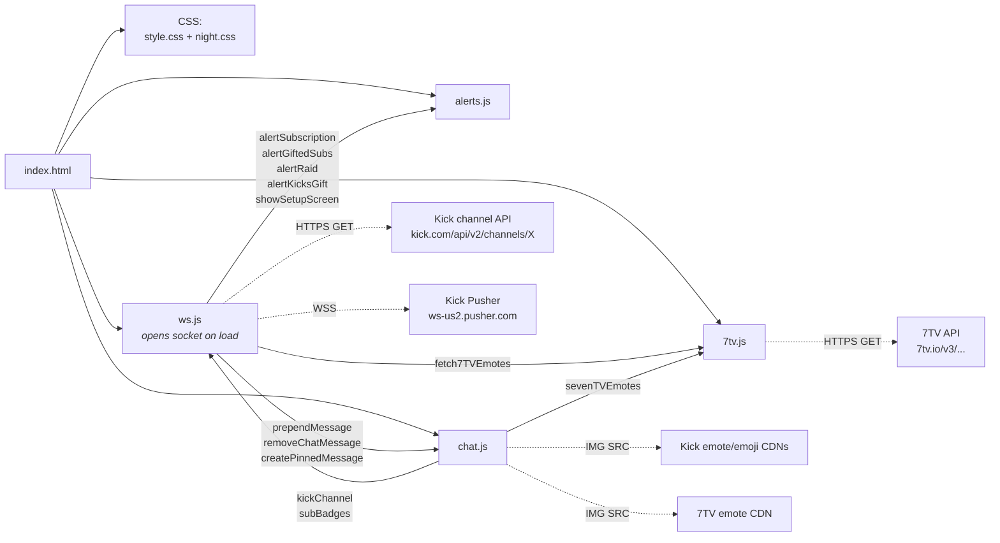
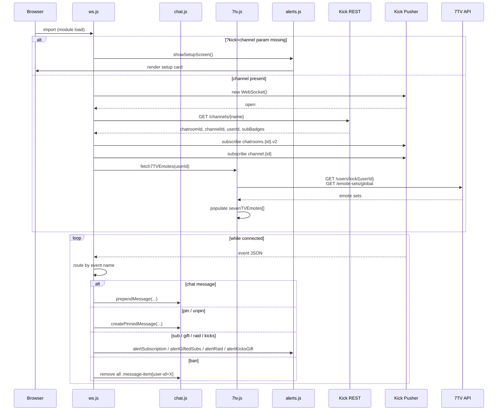
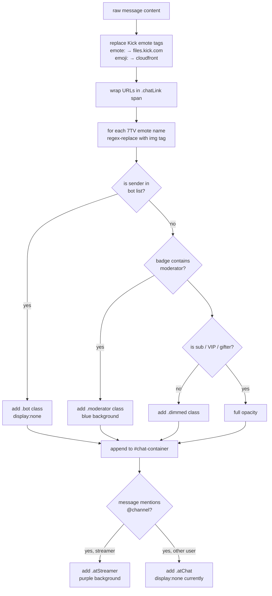

# System Architecture

chat-dock is a static-only browser overlay. There is no backend, no build step, no package manager — just HTML, CSS, and four ES modules loaded by the browser.

## Runtime topology

Solid arrows are JS imports / function calls. Dashed arrows are network calls.

## Boot sequence

## Chat-message render pipeline

The work `chat.js` does on every incoming chat message:

## Module responsibilities

| Module | Responsibility | Owns | Pure / side-effects |
|--------|---------------|------|---------------------|
| `index.html` | DOM skeleton, script tag wiring | `#alert-container`, `#container`, `#chat-container`, `#night-mode` stylesheet link | DOM only |
| `js/ws.js` | Network IO + event router | WebSocket lifecycle, `kickChannel`, `subBadges`, `minKicksAlert` | Opens socket on import; reconnects on close/error |
| `js/chat.js` | DOM rendering for messages | `finalMessage`, `messageCount`, all message DOM elements | Pure functions exported; module-level mutable state isn't great (see Code standards) |
| `js/7tv.js` | Fetch + cache 7TV emotes | `sevenTVEmotes` array | Two parallel `fetch` calls on demand |
| `js/alerts.js` | Stacking alert UI + setup screen | `#alert-container` children | Adds/removes DOM elements with setTimeout-based lifetimes |
| `css/style.css` | All base styles + alert/setup styles | All non-themed visual rules | — |
| `css/night.css` | Theme override | Background and a couple of radii | — |

## Event router

`ws.js`'s `handleWebSocketMessage` is the single entry point for every incoming Pusher event. The router branches on `messageData.event`:

| Event name | Action |
|------------|--------|
| `App\Events\ChatMessageEvent` | Build a DOM node via `chat.js#createMessage`, append it. Also handles `!nightmode` / `!daymode` commands inline. |
| `App\Events\MessageDeletedEvent` | Look up the message by id and remove it. |
| `App\Events\UserBannedEvent` | Remove every `.message-item[user-id=X]` from the DOM. |
| `App\Events\PinnedMessageCreatedEvent` | Tear down any existing pin, build a new pinned message via `chat.js#createPinnedMessage`. |
| `App\Events\PinnedMessageDeletedEvent` | Remove the most recent pinned message. |
| `App\Events\SubscriptionEvent` | Fire `alertSubscription`. |
| `App\Events\GiftedSubscriptionsEvent` | Fire `alertGiftedSubs`. |
| `App\Events\StreamHostEvent` / `ChatroomHostEvent` | Fire `alertRaid`. |
| `App\Events\KicksGifted` / `KicksGiftedEvent` / `GiftsLeaderboardUpdated` | If amount ≥ `minKicksAlert`, fire `alertKicksGift`. |
| Anything else (non-`pusher:`/`pusher_internal:`) | Log to console as `Unknown event:` for later patching. |

## Why an "unknown event" logger?

Kick.com's WebSocket events are not part of an officially documented, versioned API. Event names have been observed to change between platform updates. Rather than fail silently when the platform renames an event, the router prints unknown events to `console.log`. A streamer who notices their sub alerts have stopped firing can open DevTools, grab the new event name from the log, and either patch the source themselves or open an issue.

This is a deliberate tradeoff: prefer noisy debuggability over polished silence.

## Failure modes

| Failure | What happens | Recovery |
|---------|--------------|----------|
| Bad/missing `?kick=` param | `showSetupScreen()` renders setup card; no network calls happen. | Add the param. |
| Kick channel API down or 404 | `fetchData` retries every 1s indefinitely. | Auto-recovers when API returns. |
| WebSocket drops | `handleWebSocketClose` reconnects after 1s. | Auto-recovers. |
| 7TV API down | `fetch7TVEmotes` swallows the error and proceeds with `sevenTVEmotes = []`. | Reload when 7TV is back. |
| Unknown badge type | `chat.js` requests `assets/{type}.svg`. If that asset doesn't exist, the image is broken. | Add the SVG to `assets/`. |
| Missing `assets/subscriber.svg` (referenced as fallback) | Broken image for sub badge when channel has no sub-badge tiers. | Add the asset. |
| Event name renamed by Kick | Alert doesn't fire. `Unknown event:` printed. | Patch the event name in `ws.js`. |

## See also

- [Codebase summary](codebase-summary.md) — file inventory
- [Configuration guide](configuration-guide.md) — URL params, CSS variables
- [Code standards](code-standards.md) — conventions
